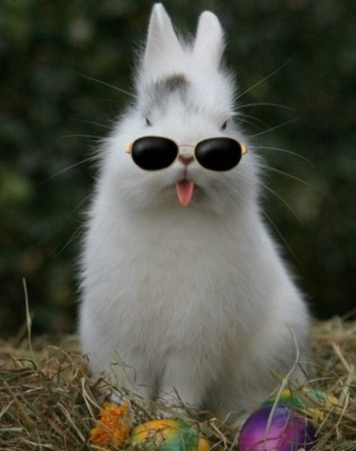
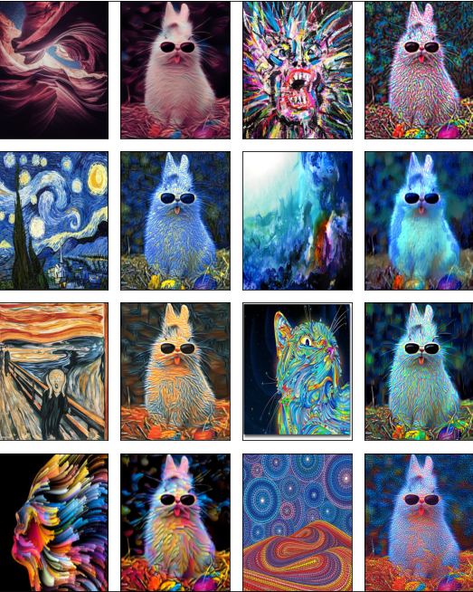

# Psychedelic Bunny Rabbit

[Notekook](PsychedelicBunnyRabbit.ipynb)

These are the results:

## Credits

I followed these tutorials:

- [Gatys Image Style Transfer Paper](https://www.cv-foundation.org/openaccess/content_cvpr_2016/papers/Gatys_Image_Style_Transfer_CVPR_2016_paper.pdf)
- [Medium's NST Guide in Pytorch](https://medium.com/@vijay.prayagala/style-transfer-of-images-with-cnn-in-pytorch-7c771f8f391d) - ([notebook](https://colab.research.google.com/drive/1ZiPZ3B3gRMaMtWl_1u_XksAPdv5ane5e))
- [TDS't NST Guide in Tensorflow](https://towardsdatascience.com/light-on-math-machine-learning-intuitive-guide-to-neural-style-transfer-ef88e46697ee) - ([notebook](https://github.com/thushv89/exercises_thushv_dot_com/blob/master/neural_style_transfer_light_on_math_ml/neural_style_transfer.ipynb))
